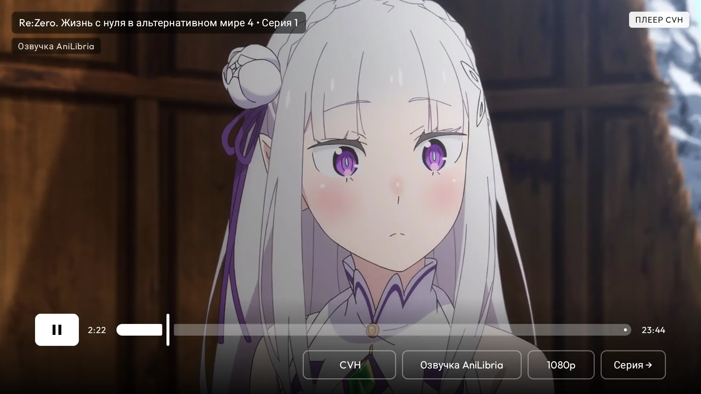
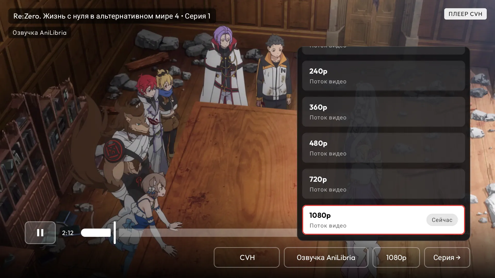
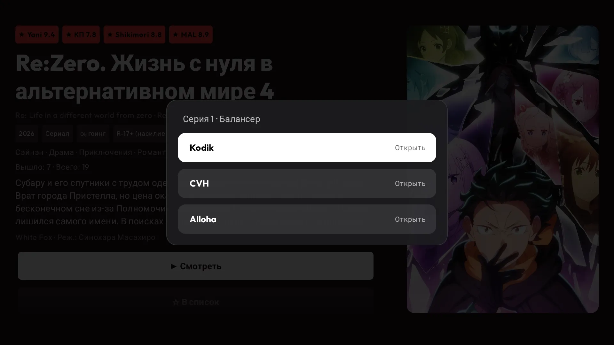
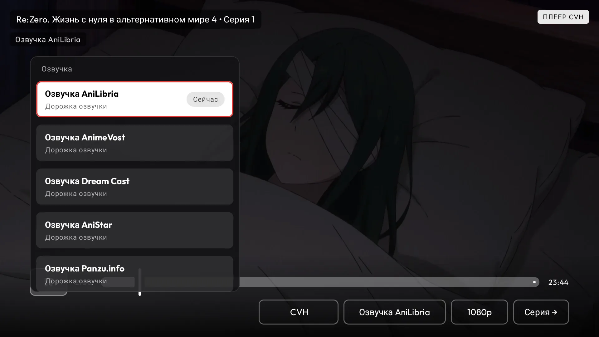
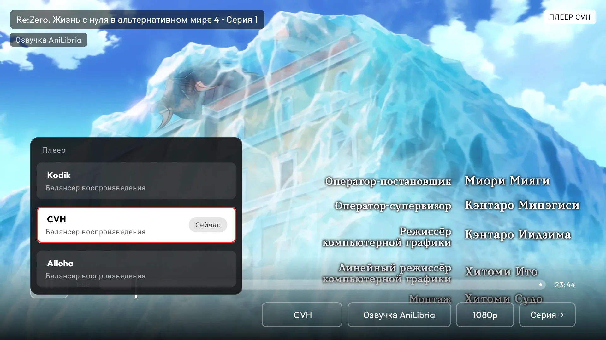

  

<h1 align="center">YummyTV</h1>

  Unofficial Android TV client for <a href="https://yummyani.me">yummyani.me</a> 
  Anime on the big screen: remote control, D-pad navigation, and no browser required.

  <a href="README.md">Русский</a>

  
  
  

---

## What is YummyTV

YummyTV is a native Android TV app for watching anime from yummyani.me directly on your television. The interface is built for the big screen, remote control navigation, and Android TV focus behavior, so you do not have to open the website in a browser or fight with a cursor.

The app is not an official yummyani.me client. It does not host video or distribute content; it works as a TV-friendly viewing shell for Android TV devices.

## Features

- Full anime playback on TV
- Remote control, D-pad, and Android TV focus navigation
- Anime search across the yummyani.me catalog
- Home screen with curated sections and continue watching
- Details screen with description, episodes, trailers, and similar titles
- Top-100 and collections
- Local library and watch history

## Screenshots

| Home | Details |
| --- | --- |
|  |  |

| Top100 | Series |
| --- | --- |
|  |  |

| ContinueWatching | Similar |
| --- | --- |
|  |  |

| Player |
| --- |
|  |

| PlayerQuality | SelectBalancer |
| --- | --- |
|  |  |

| PlayerVoice | PlayerBalancer |
| --- | --- |
|  |  |

## Download

Install the Android TV APK from [GitHub Releases](https://github.com/3n3my3/yummytv/releases). Open the latest release, download the APK, and install it on your Android TV or Android TV box.

## How to send the APK to your TV

If the APK is on your phone or computer, you can send it to Android TV with [LocalSend](https://localsend.org/). Install LocalSend on both devices, connect them to the same Wi-Fi network, select the APK on your phone or computer, and send it to the TV. After receiving it, open the file on the TV and allow installation from that source if Android asks for confirmation.

## Limitations

> **CIS users only.** The video balancers used by yummyani.me may not work with European or American IP addresses. If you are outside the CIS region, video playback may be unavailable.

YummyTV depends on the availability of yummyani.me and third-party video balancers. If the website, a specific player, or a source is temporarily unavailable, the app may not be able to play the video either.

## Project status

The project is under active development. Feedback, bug reports, and ideas are welcome: open an issue in the repository or reach out directly.
