

  

<h1 align="center">YummyTV</h1>

  An unofficial <a href="https://yummyani.me/">YummyAnime</a> client for Android TV and Android. 
  Native UI, built-in player, library, subscriptions, and remote-friendly TV navigation.

  <a href="README.md">Русский</a> · <a href="README.en.md">English</a>

  
  
  
  

  
  
  
  

---

## What is YummyTV?

**YummyTV** is a native Android app for watching anime from YummyAnime. The project includes two
separate experiences: a TV-first interface for Android TV / set-top boxes and a mobile interface for
Android phones.

Beyond streaming, the built-in player, and the library, the app includes community features
(comments, reviews, news, bloggers), social features (profiles, user search, direct messages), and
episode downloads for offline viewing.

On TV, the app is designed for remote control, D-pad navigation, and large UI elements. On mobile,
it supports bottom navigation, player gestures, and Picture-in-Picture.

  <a href="https://github.com/Helandy/YummyTV/releases/latest"><b>Download APK</b></a>
  ·
  <a href="#screenshots"><b>Screenshots</b></a>
  ·
  <a href="#features"><b>Features</b></a>
  ·
  <a href="#for-developers"><b>For developers</b></a>

---

## Screenshots

### Android TV

<table>
  <tr>
    <td align="center"><b>Home</b></td>
    <td align="center"><b>Title details</b></td>
    <td align="center"><b>Top</b></td>
  </tr>
  <tr>
    <td>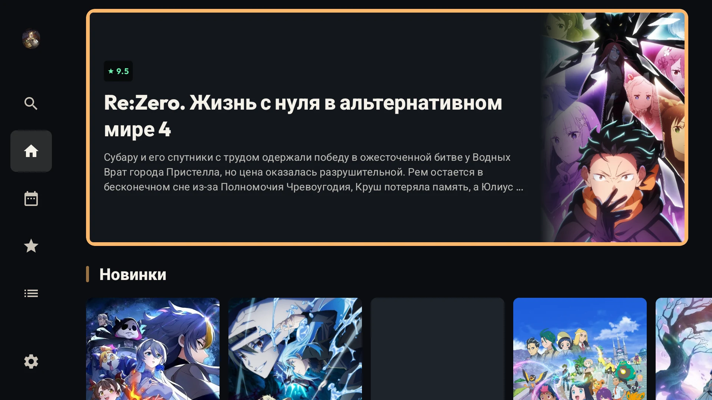</td>
    <td>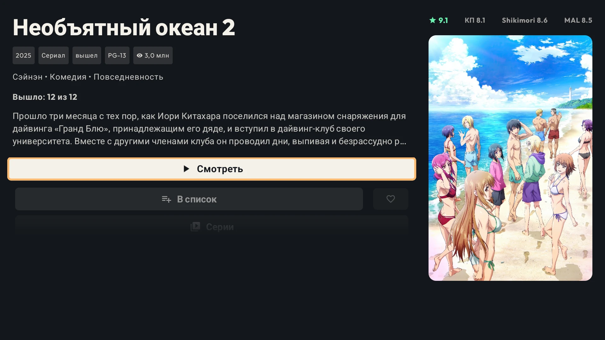</td>
    <td>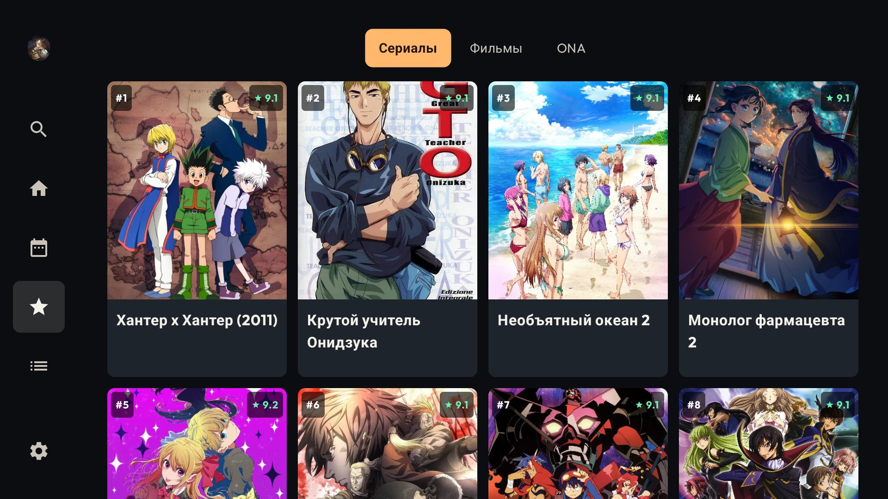</td>
  </tr>
  <tr>
    <td align="center"><b>Episodes</b></td>
    <td align="center"><b>Balancers</b></td>
    <td align="center"><b>Viewing order</b></td>
  </tr>
  <tr>
    <td>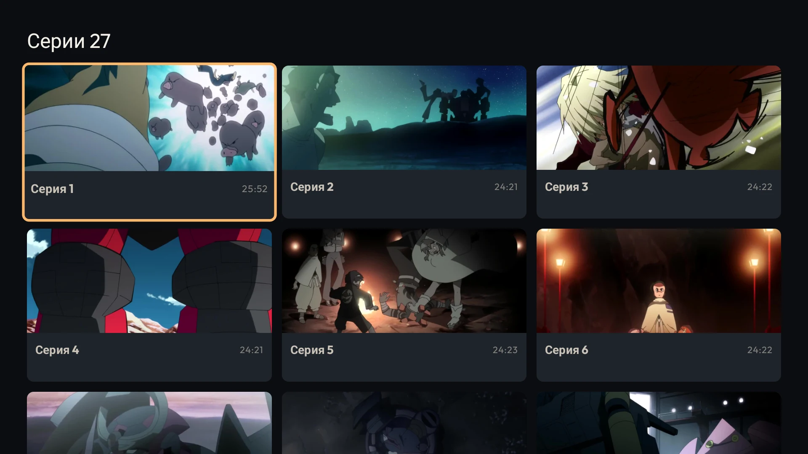</td>
    <td>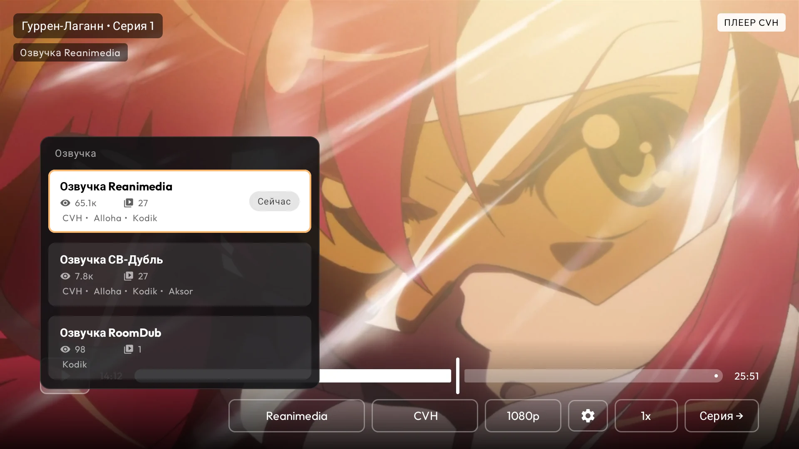</td>
    <td>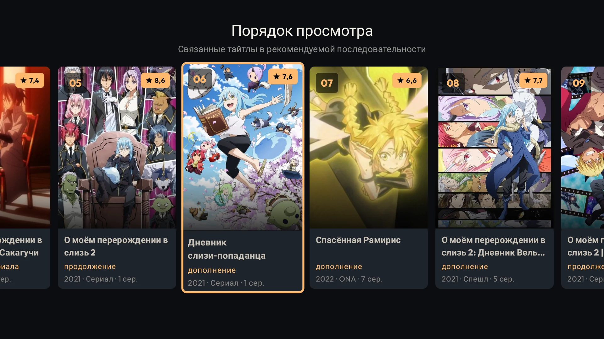</td>
  </tr>
</table>

  <b>Player</b> 
  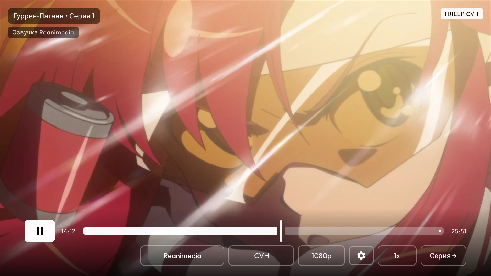

### Android Mobile

<table>
  <tr>
    <td align="center"><b>Home</b></td>
    <td align="center"><b>Title details</b></td>
    <td align="center"><b>Top</b></td>
  </tr>
  <tr>
    <td>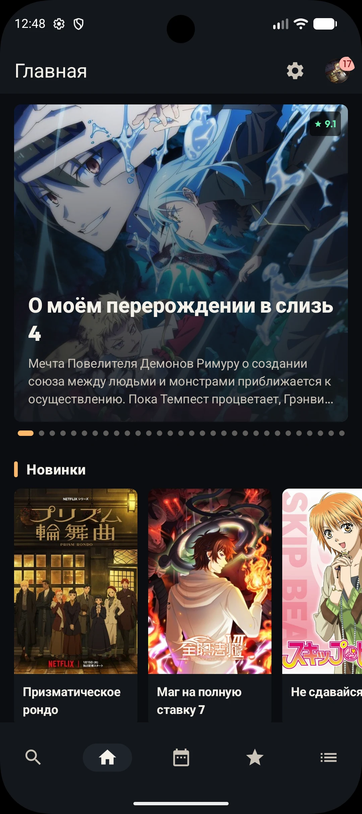</td>
    <td>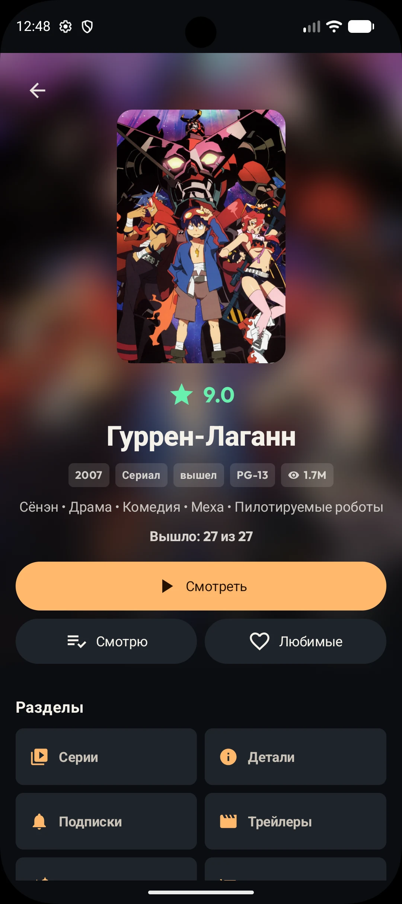</td>
    <td>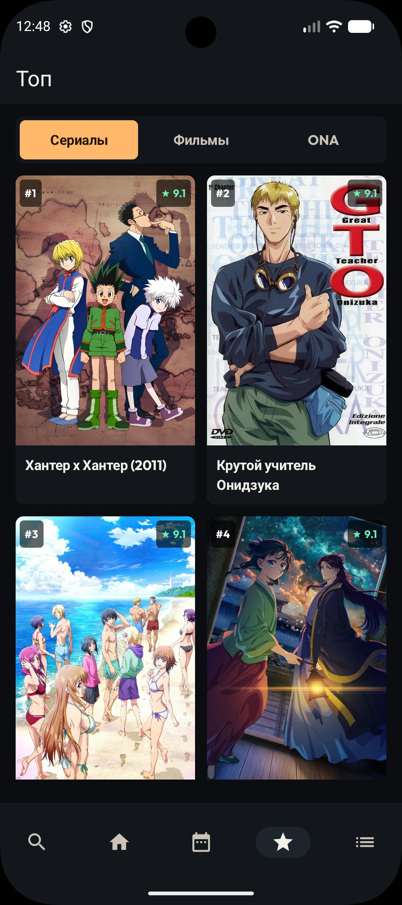</td>
  </tr>
  <tr>
    <td align="center"><b>Library</b></td>
    <td align="center"><b>Profile</b></td>
    <td align="center"><b>Balancers</b></td>
  </tr>
  <tr>
    <td>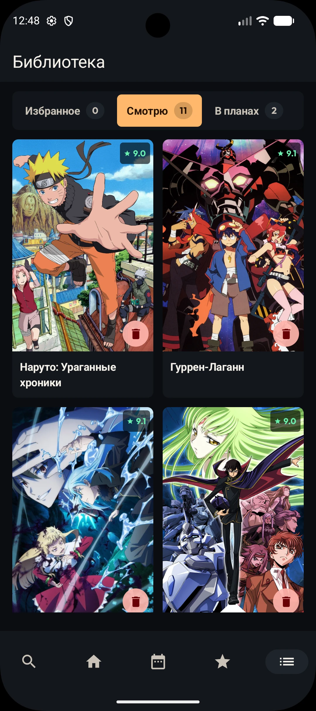</td>
    <td>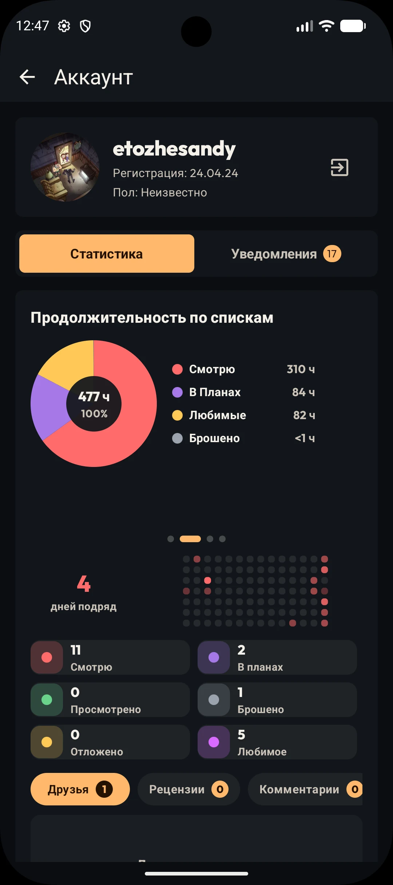</td>
    <td>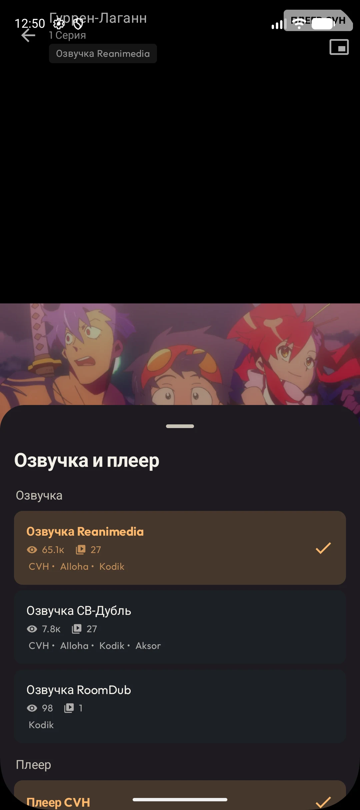</td>
  </tr>
</table>

  <b>Player</b> 
  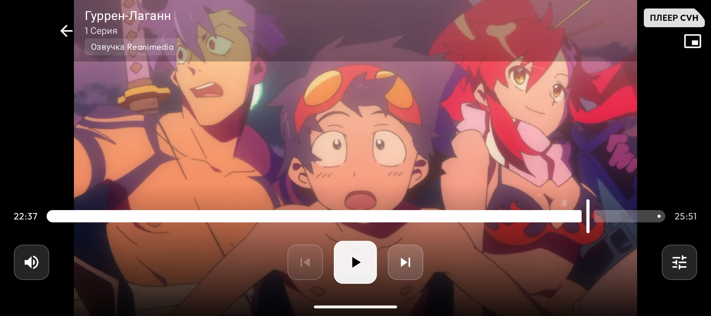

---

## Features

### Interface

- 📺 Separate interfaces for Android TV and Android Mobile.
- 🎮 Remote, D-pad, and touch navigation.
- 🏠 Home screen with collections and quick continue watching.
- 🔎 Catalog search with filters (genre, type, status, year, season, rating, sorting), plus search by
  studio and director.
- 🏆 Top anime series and movies, and the episode release schedule.
- 🖼️ Poster and screenshot viewer inside the app.

### Library and account

- 🔐 YummyAnime account login.
- 📚 Library sections: continue watching, favorites, watching, planned, completed, postponed, and
  dropped.
- 🔔 Subscriptions for new episodes from selected voice-over teams, with a prompt to subscribe to
  ongoing titles.
- ⭐ Favorites, user lists, and ratings.
- 📄 Title page: description, ratings, episodes with titles, trailers, similar titles, viewing order,
  screenshots, collections, and a countdown to the next episode.

### Community and social

- 💬 Comments with replies, sorting, voting, and spoiler hiding.
- 📝 Title reviews with ratings, reactions, and moderation status.
- 📰 Site news and publications, plus blogger videos with subscriptions.
- 👤 User profiles, search, friends, and direct messages (on mobile).

### Downloads and offline

- ⬇️ Download episodes for offline viewing, a download manager, and MP4 export (on mobile).

### Player

The built-in player is based on **Media3 / ExoPlayer** and supports:

- quality, voice-over, and balancer selection (Kodik, Aksor, Alloha, CVH, VK, Rutube, Sibnet,
  Zedfilm);
- playback speed, scale and zoom, and automatic opening/ending skip;
- previous/next episode navigation and auto-play of the next episode;
- mobile gestures (brightness, volume, seeking, zoom) and mouse control on TV;
- Picture-in-Picture, local file playback, and a rating suggestion after watching.

### Settings and integrations

- 🎨 App themes and background mode (light / dark / system).
- 🧩 Details button order, card sizes, poster quality, and content language.
- 🏡 TV Home (Preview Channel, Watch Next), FAQ, and GitHub Releases updates.

---

## Download

The latest version is available on **GitHub Releases**:

  

Download the APK, transfer it to your Android TV, set-top box, or Android device, and open the file
to install it.

### How to install on Android TV

The easiest way to transfer the APK to a TV is [LocalSend](https://localsend.org/):

1. Install LocalSend on your phone or computer.
2. Install LocalSend on Android TV.
3. Connect both devices to the same Wi-Fi network.
4. Send the APK to your TV.
5. Open the APK on TV and allow installation from this source if Android asks for confirmation.

---

## For developers

The project is built with Kotlin and a modular architecture.

### Structure

- `core/*` — shared systems: navigation, design system, network, storage, settings, updates, deep
  links, analytics, and TV integrations.
- `feature/*` — user scenarios: main, home, search, top, library, details, player, settings,
  account, collection, schedule, plus comments, reviews, posts, bloggers, messages, video-download,
  faq, pages, watching, and commonScreen.
- `ui-tv` and `ui-mobile` — separate UI modules for TV and mobile devices.

## Limitations

YummyTV depends on YummyAnime and third-party video balancers. If the website, API, player, or
source is temporarily unavailable, some features or video playback may not work.

For users outside CIS countries, some video balancers may be unavailable due to regional
restrictions or IP blocks.

---

## ☕ Support the project

YummyTV is developed and maintained independently.

If you enjoy using the app and want to support its future development:

You can also support the project for free:

* ⭐ **Star the repository** — it helps others discover the project
* 🐞 **Report bugs** via [Issues](https://github.com/Helandy/YummyTV/issues)
* 💡 **Suggest improvements** via [Discussions](https://github.com/Helandy/YummyTV/discussions) or [Issues](https://github.com/Helandy/YummyTV/issues)

---

## Disclaimer

- YummyTV is an unofficial YummyAnime client.
- The app does not host, store, or distribute content.
- All rights belong to their respective owners.
