

  

<h1 align="center">YummyTV</h1>

  Неофициальный Android-клиент для <a href="https://yummyani.me/">yummyani.me</a> 
  Смотри аниме на Android TV, приставке или телефоне с нативным интерфейсом и встроенным плеером.

  <a href="README.en.md">English README</a>

  
  
  

## Что это

YummyTV — нативное Android-приложение для просмотра аниме с yummyani.me. Оно больше не
ограничивается только телевизором: в проекте есть отдельные интерфейсы для Android TV и мобильных
Android-устройств.

На TV приложение рассчитано на пульт и D-pad: без браузера, курсора и мелких веб-элементов. На
телефоне доступен мобильный интерфейс с нижней навигацией, жестами в плеере и Picture-in-Picture.

## Возможности

- 📺 Отдельные TV и mobile интерфейсы.
- 🎮 Удобная навигация пультом, D-pad и сенсорным экраном.
- 🔎 Поиск по каталогу с фильтрами по жанрам, типу, статусу, году, сезону, возрастному рейтингу и
  сортировке.
- 🏠 Главная с подборками и быстрым продолжением просмотра.
- 📅 Расписание выхода серий.
- 🏆 Топ сериалов и фильмов.
- 📚 Библиотека: продолжить просмотр, любимые, смотрю, в планах, просмотрено, отложено и брошено.
- 📄 Страница тайтла с описанием, рейтингами, списком серий, трейлерами, похожими тайтлами, порядком
  просмотра, скриншотами и коллекциями.
- 🔔 Подписки на новые серии выбранных озвучек.
- ⭐ Избранное, пользовательские списки и оценки.
- 🖼️ Просмотр постеров и скриншотов внутри приложения.

## Плеер

Встроенный плеер построен на Media3/ExoPlayer и поддерживает:

- выбор качества, озвучки и видеобалансера;
- плеер по умолчанию: Kodik, Aksor, Alloha, CVH, VK или Rutube;
- скорость воспроизведения;
- масштаб и зум видео;
- автопропуск опенинга и эндинга, если для серии есть таймкоды;
- переход к предыдущей или следующей серии;
- предложение оценить тайтл после просмотра;
- Picture-in-Picture на мобильных устройствах.

## Настройки и интеграции

- Темы оформления: тёплый янтарь, сакура, мята, океан и графит.
- Размер карточек и качество постеров.
- Размер кэша превью.
- Язык контента: по умолчанию, русский, английский или украинский.
- Настраиваемый порядок кнопок на странице тайтла.
- TV Home: Preview Channel с новинками и Watch Next для продолжения просмотра.
- Проверка новых GitHub Releases и установка обновлений APK из приложения.

## Скриншоты

### TV

|                                      Главная                                       |                                   Тайтл                                    |                                 Топ                                  |
|:----------------------------------------------------------------------------------:|:--------------------------------------------------------------------------:|:--------------------------------------------------------------------:|
| 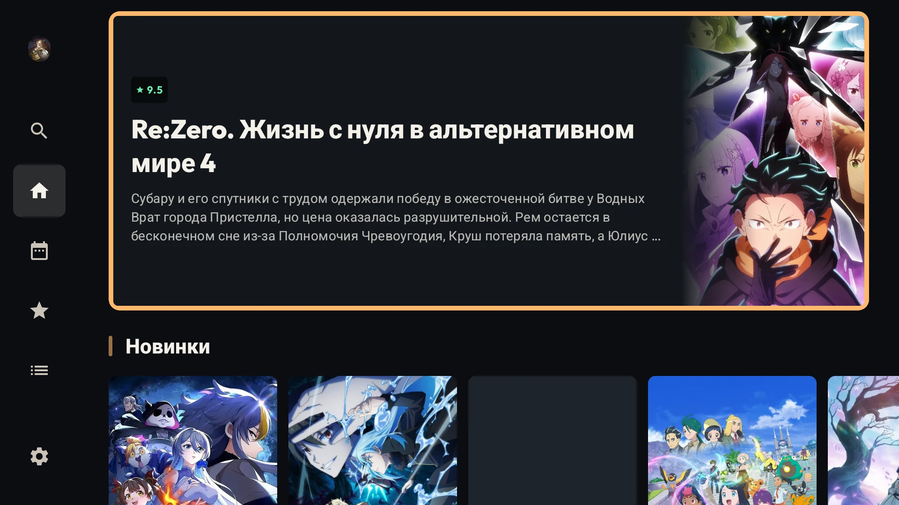 | 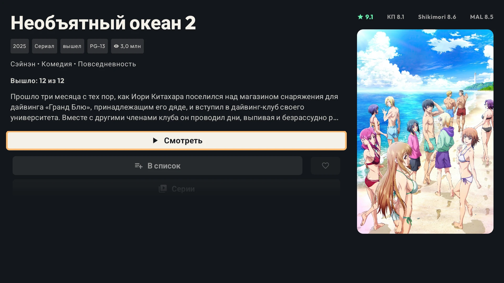 | 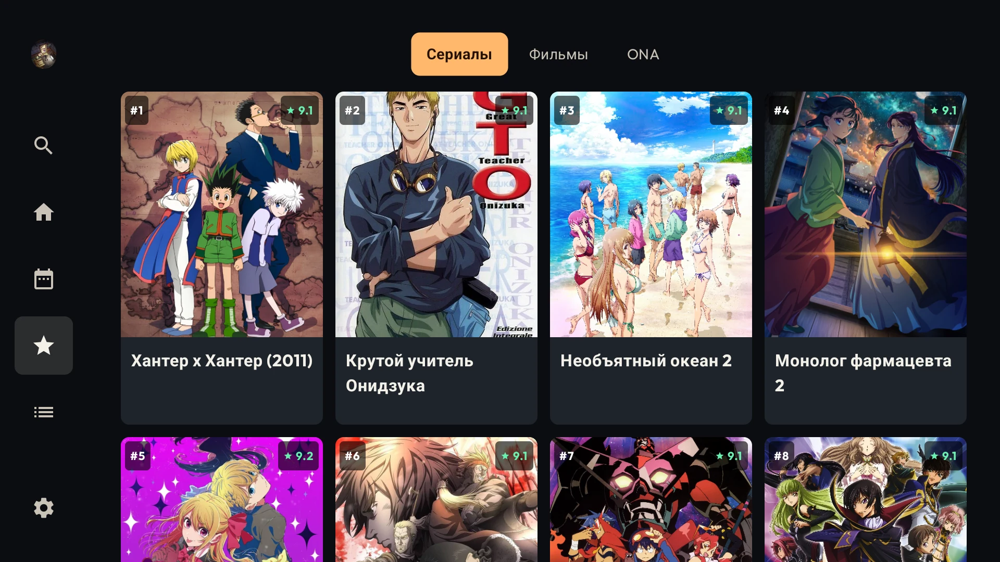 |

|                                    Серии                                    |                                    Балансеры                                     |                                      Порядок просмотра                                       |
|:---------------------------------------------------------------------------:|:--------------------------------------------------------------------------------:|:--------------------------------------------------------------------------------------------:|
| 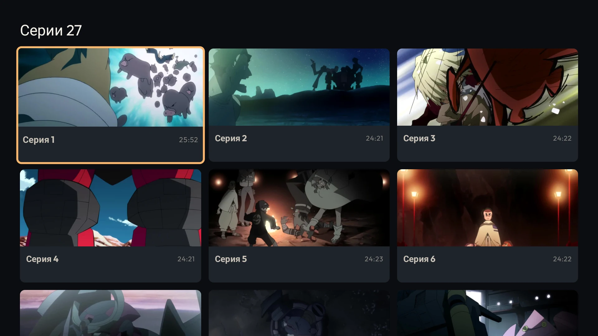 | 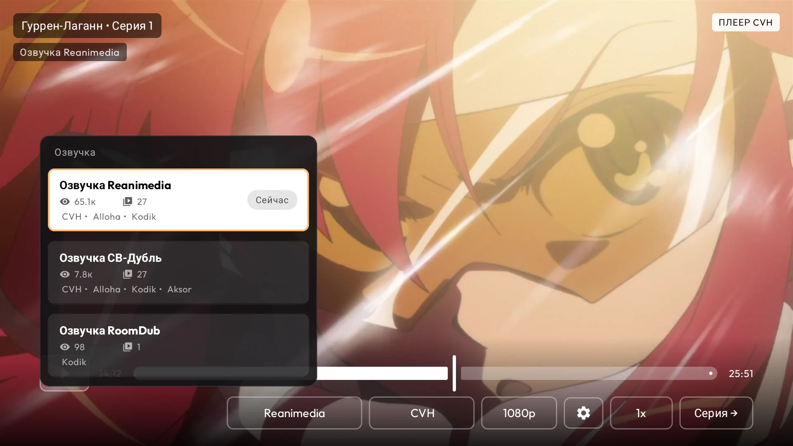 | 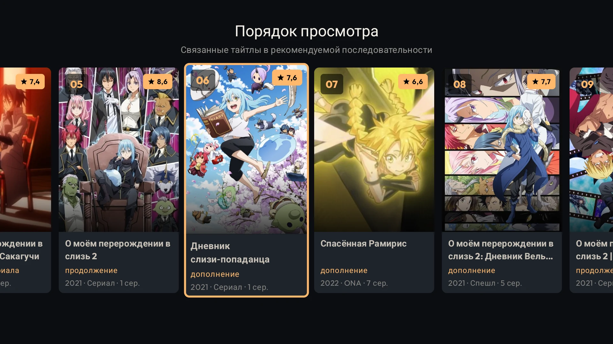 |

|                                   Плеер                                   |
|:-------------------------------------------------------------------------:|
| 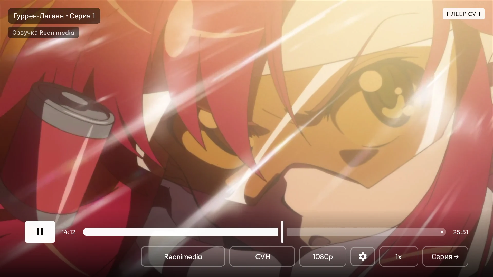 |

### Mobile

|                                          Главная                                           |                                       Тайтл                                        |                                     Топ                                      |
|:------------------------------------------------------------------------------------------:|:----------------------------------------------------------------------------------:|:----------------------------------------------------------------------------:|
| 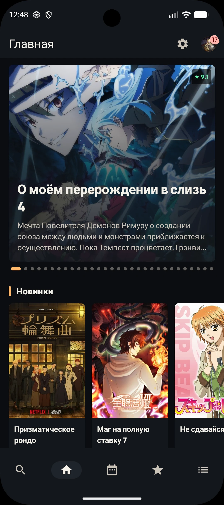 | 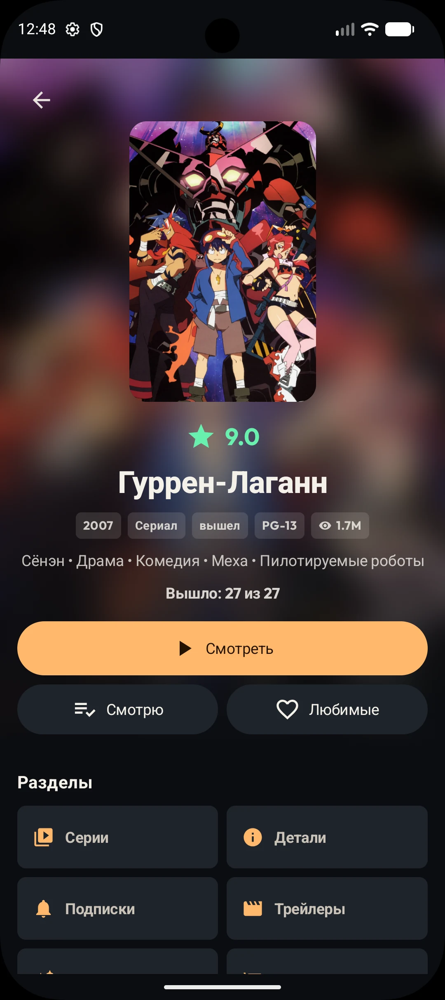 | 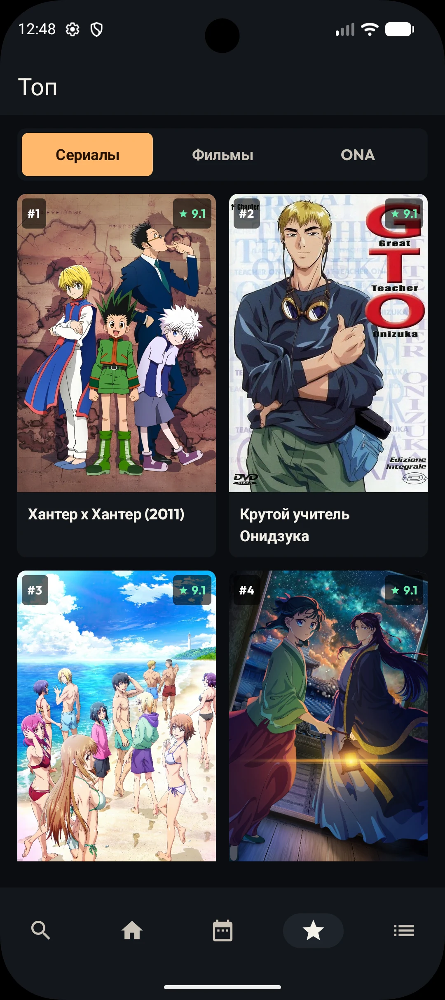 |

|                                       Библиотека                                        |                                       Профиль                                        |                                        Балансеры                                         |
|:---------------------------------------------------------------------------------------:|:------------------------------------------------------------------------------------:|:----------------------------------------------------------------------------------------:|
| 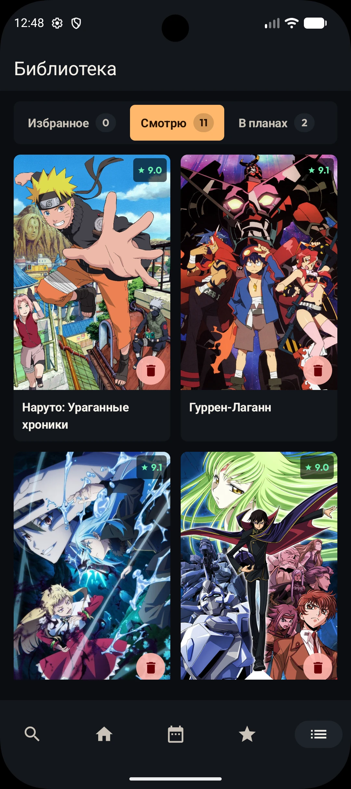 | 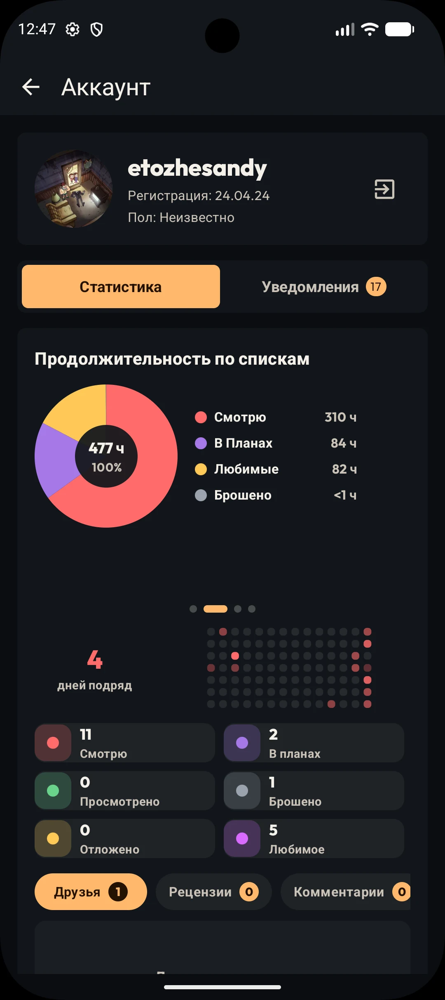 | 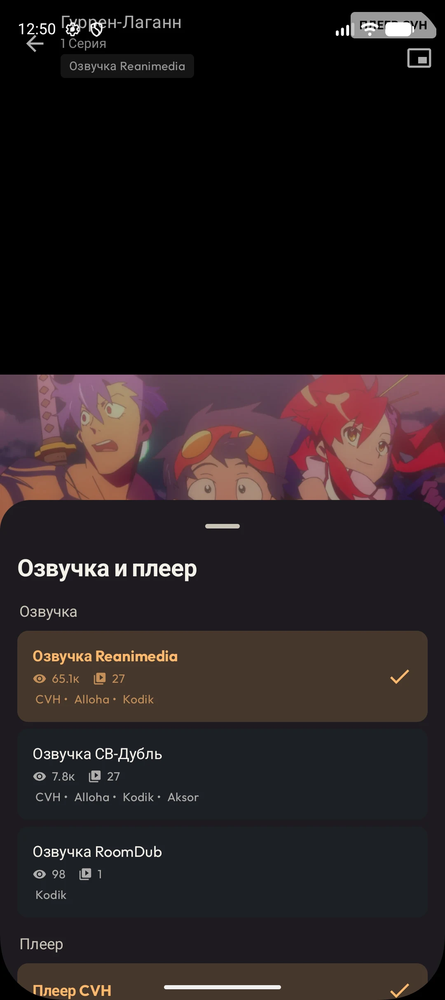 |

|                                       Плеер                                       |
|:---------------------------------------------------------------------------------:|
| 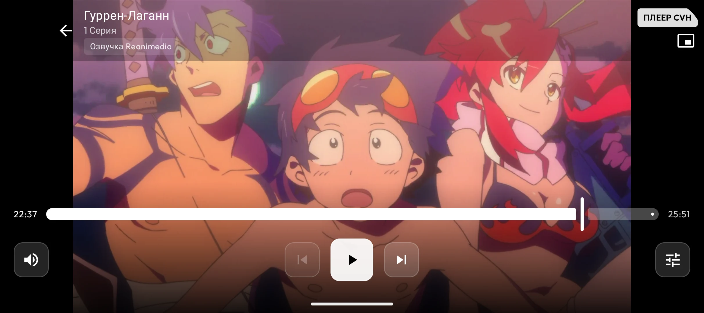 |

## Загрузка

Установи последнюю версию APK из [GitHub Releases](https://github.com/Helandy/yummytv/releases).

Скачай APK, передай его на телевизор, Android TV приставку или Android-устройство и открой файл для
установки.

## Как установить на Android TV

Самый простой способ передать APK на телевизор — через [LocalSend](https://localsend.org/):

1. Установи LocalSend на телефон или компьютер.
2. Установи LocalSend на Android TV.
3. Подключи оба устройства к одной Wi-Fi сети.
4. Отправь APK на телевизор.
5. Открой APK на TV и разреши установку из этого источника, если Android попросит подтверждение.

## Для разработчиков

Проект построен на Kotlin и чистой модульной архитектуре:

- `core/*` содержит общие подсистемы: навигацию, дизайн-систему, сеть, хранилище, настройки,
  обновления, deep links, аналитику и TV-интеграции.
- `feature/*` разделён по пользовательским сценариям: main, home, search, top, library, details,
  player, settings, account, collection и schedule.
- UI написан на Jetpack Compose с отдельными `ui-tv` и `ui-mobile` модулями.
- Используются Navigation 3, Hilt, Ktor, Room, DataStore, Coil, WorkManager и Media3.

## Ограничения

YummyTV зависит от доступности yummyani.me и сторонних видеобалансеров. Если сайт, API, плеер
или источник временно недоступны, часть функций или воспроизведение видео могут не работать.

Для пользователей за пределами СНГ часть видеобалансеров может быть недоступна из-за региональных
ограничений или блокировок IP-адресов.

## Поддержка

- ⭐ Поставь звезду репозиторию.
- 🐞 Открой issue, если нашёл баг.
- 💡 Предложи улучшение через Issues.

## Disclaimer

- YummyTV — неофициальный клиент.
- Приложение не хранит и не распространяет контент.
- Все права принадлежат их владельцам.
