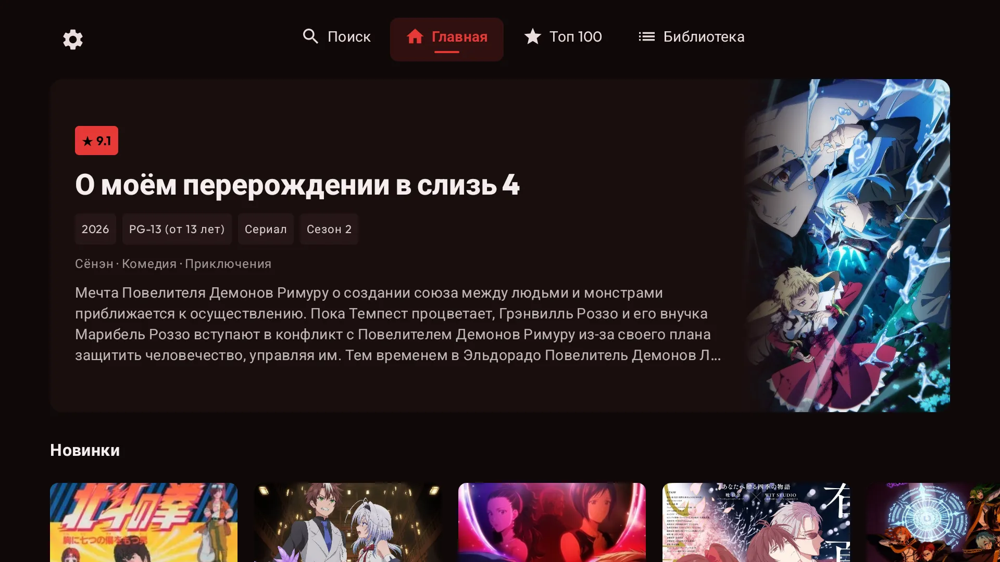
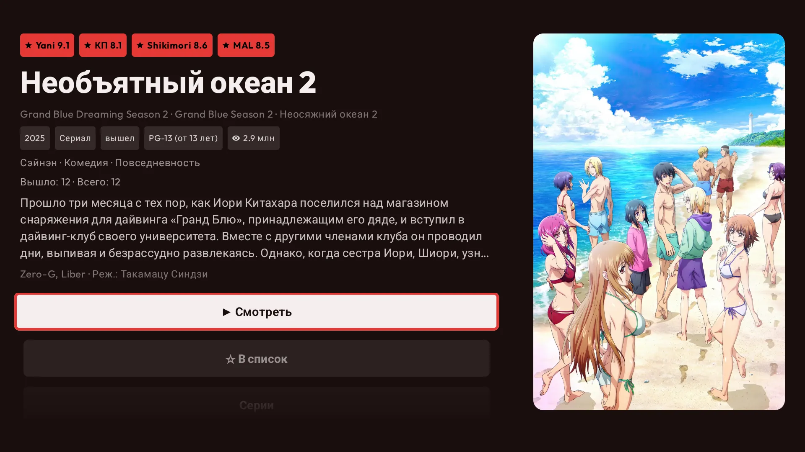
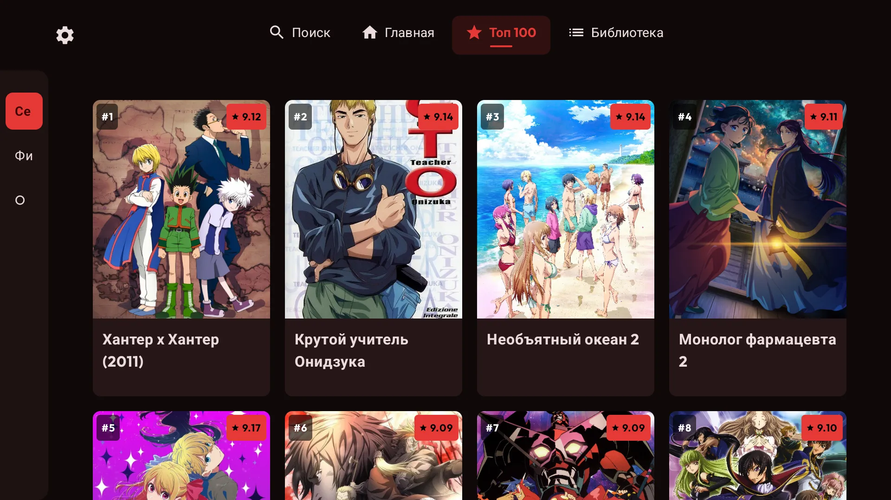
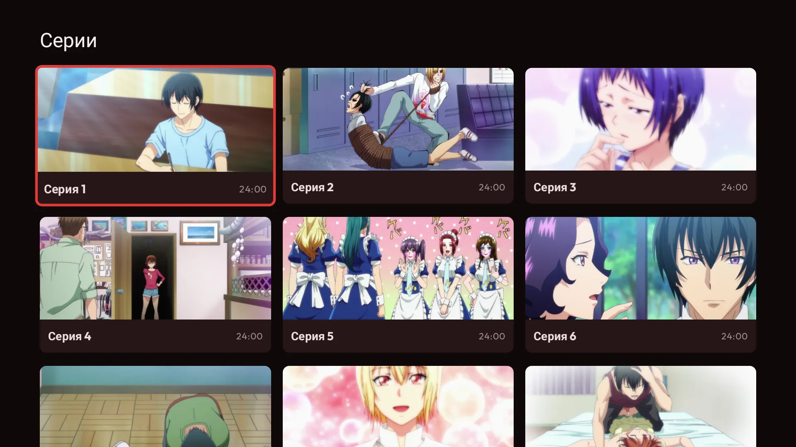
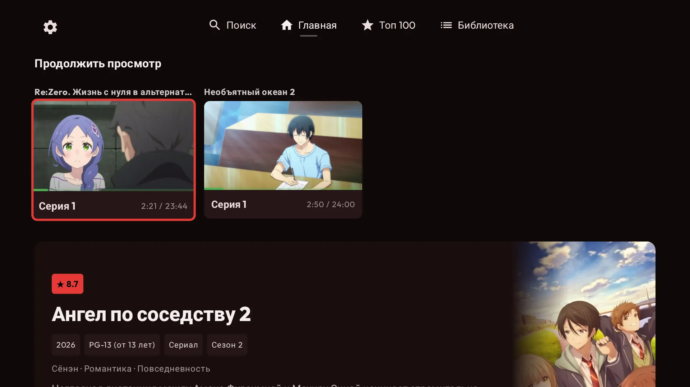
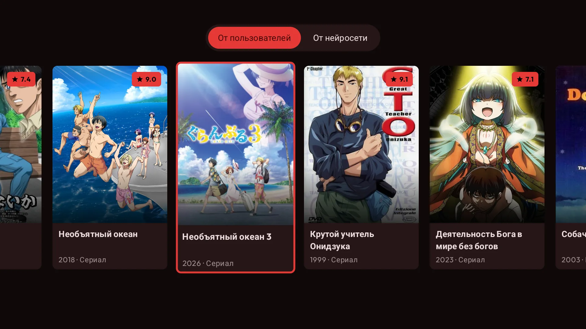

  

<h1 align="center">YummyTV</h1>

  Неофициальный Android TV клиент для <a href="https://yummyani.me/">yummyani.me</a> 
  Смотри аниме на большом экране с удобной навигацией под пульт и производительным плеером

  <a href="README.en.md">English README</a>

  
  
  

## Android TV клиент для YummyAnime

YummyTV — нативное приложение для Android TV, которое делает просмотр аниме с yummyani.me удобнее на телевизоре:

- управление пультом без курсора и браузера;
- интерфейс, адаптированный под большой экран;
- поиск по каталогу;
- быстрый доступ к тайтлам, эпизодам и продолжению просмотра;
- встроенный плеер с выбором качества, озвучки и балансера.

## Возможности

- 📺 Интерфейс для Android TV
- 🎮 Навигация пультом и D-pad
- 🔎 Поиск аниме по каталогу yummyani.me
- 🏠 Главная страница с подборками
- ▶️ Продолжение просмотра
- 📄 Страница тайтла с описанием, эпизодами и трейлерами
- 🎞️ Похожие тайтлы
- 🏆 Топ и коллекции
- 📚 Локальная библиотека
- 🕘 История просмотра
- ⚙️ Выбор качества, озвучки и видеобалансера

## Скриншоты

|                              Home                               |                                Details                                |                              Top                              |
|:---------------------------------------------------------------:|:---------------------------------------------------------------------:|:-------------------------------------------------------------:|
|  |  |  |

| Series | Continue Watching | Similar |
|:---:|:---:|:---:|
|  |  |  |

| Player | Quality | Voice |
|:---:|:---:|:---:|
|  |  |  |

| Select Balancer | Player Balancer |
|:---:|:---:|
|  |  |

## Загрузка

Установи последнюю версию APK из [GitHub Releases](https://github.com/Helandy/yummytv/releases).

Скачай APK, передай его на телевизор или Android TV приставку и открой файл для установки.

## Как установить на Android TV

Самый простой способ передать APK на телевизор — через [LocalSend](https://localsend.org/):

1. Установи LocalSend на телефон или компьютер.
2. Установи LocalSend на Android TV.
3. Подключи оба устройства к одной Wi-Fi сети.
4. Отправь APK на телевизор.
5. Открой APK на TV и разреши установку из этого источника, если Android попросит подтверждение.

## Ограничения

YummyTV зависит от доступности yummyani.me и сторонних видеобалансеров. Если сайт, плеер или источник временно недоступны, видео может не запускаться.

Для пользователей за пределами СНГ часть видеобалансеров может быть недоступна из-за региональных ограничений или блокировок IP-адресов.

## Поддержка

- ⭐ Поставь звезду репозиторию
- 🐞 Открой issue, если нашёл баг
- 💡 Предложи улучшение через Issues

## Disclaimer

- YummyTV — неофициальный клиент.
- Приложение не хранит и не распространяет контент.
- Все права принадлежат их владельцам.
